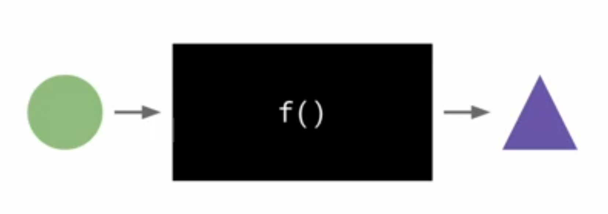
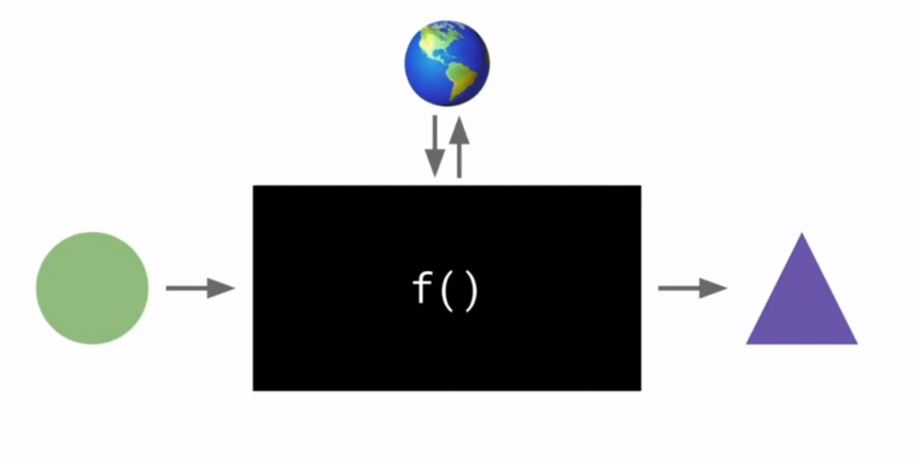
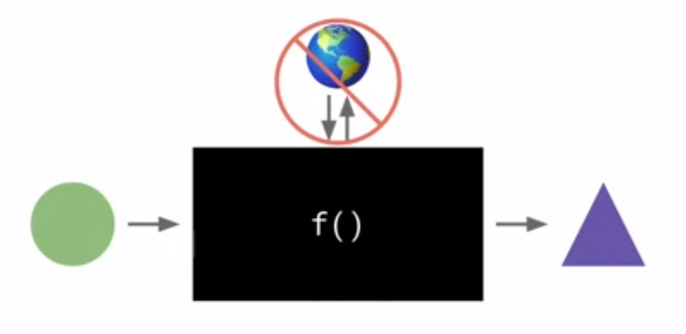

# functional-javascript-tutorial
In this friendly introduction to functional programming with JavaScript, you'll learn what Functional Programming (FP) is and how it differs from other programming styles (such as OO and imperative). You'll practice the key idea of doing everything with pure functions, learning to use higher-order functions and recursion to replace the iterative loops we're used to writing with for and while. You'll more to advanced techniques like closures, currying, and function composition and learn why immutable data is essential for functional programming.

# Introduction
* This will help you understand basic concepts of Functional Programming
* Core Ideas to get started as Functional Programmers

Different programming paradigmns are really interesting to me. We will be noob functional programmers.

## What we will learn?
* What is a functional programming?
* What does it mean to do functional programming?
* What does functional code look like?
* What tools do we need to write functional programs?

JavaScript is not considered a great functional language but its great to learn functional programming.

## Concepts
* Pure functions
* Side effects
* Programs as pipelines where data flows
* Higher order functions
* First class functions
* Currying
* Closure
* Immutability, changing data so it works with functional programming

We are focused on JavaScript. Focus on concepts.

## What is functional programming?
* buzz words and concepts
* Keywords: stateless, compose, pure, functor, monad, curry, side effect, lazy, monoid, immutable, higher-order, referential transparecy
* It is a style of programming
* JS - does not get described as a functional language
* Learning FP(functional programming) made me a better JS developer once I learnt basic FP
* A programming paradigm (world view/mindset) - what things are in it and how they interact?

### Other paradigms
* Imperative - Follow my commands and do that
* Declarative - I want to do it that way but its up to you
* Object Oriented - managing state, inheritance
* Functional: SINGLE Thing - pure functions - only input in and only output out
Turn iterations of lists into maps and reduces
Think of the race. Break code into functions. Make those functions functional. Turn a loop that repeats a process into a recursion.
Think of the bands. Turn a sequence of operations into a pipeline.

READ THIS:
[Introduction to FP by Mary Rose Cook](https://codewords.recurse.com/issues/one/an-introduction-to-functional-programming "Introduction to FP by Mary Rose Cook")

## Pure Functions
### only input in ---> only output out
* A pure function is a function
* It only takes the input in and returns output
* Apart from the input id does not touch any data

Example of Pure function


The above diagram shows:
* Pure function is like a black box
* Green circle goes in as input and gets converted to triangle

While working, we have some pressure to complete the work done or just complete the coding exercises and what it makes the function do is it takes the input, it does give us the desireable output but it also communicates with the outside world.

Example of Impure function


So it also might be reading things from outside world to make its computation a lot more easier. Like what time is it or what profile picture does this user have. Things that **aren't direct input to the function** but **it uses them for their computational purposes**. 

It may also be considered as impure if the function might **change a value other than input and outside it's scope.** OR **call other function**.

That communication with outside world is called **side-effects**. That is what is not allowed in a pure-function.


So in a pure function is a function that does not have any side-effects. All it needs is an input and all it does is return its output value.

## Tradeoffs
Each paradigm has tradeoffs. Mostly complex program to be broken to smaller entities.
As developer, learn as many paradigms as possible and to think them as tools in our mental toolbox and we can effortlessly switch to.

## Pure functions vs Impure functions

**Impure Function:**
```javascript
let author = "Alonzo";

function greet() {
    console.log(`Hello, ${author}!`);
}

greet();
author = "Alan";
greet();
```

**Pure Function:**
```javascript
function greet(author) {
  console.log(`Hello, ${author}!`);
}

greet("Alonzo");
greet("Alan");
```

Functional programming must help us write more re-usable code.
### Differences
* In the impure function, Unexpected output if the variable changes at a point of time when the function is called. Output changes depending on external circumstances. VS in Pure function I get the same output for the same input always.
A pure function, every time we call it with same argument we get the same result -- guaranteed. Because, output of the function does not depend upon the outside world. It depends upon the arguments that are passed in. It is deterministic based on input.
* Anything that is going inside the program, all the computed things are much predictable inside pure function.

If a function does not take any input, its a yellow flag. Not returning a flag is a huge red flag.

## Why functional programming?
* Why would be bother about all this?
* When functions are deterministic, when we know exactly what output we are going to get on what input, we are going to become much more predictable. The code will be much more safer.
* Less opportunity for bugs to arise.
* Easier to test and debug AND maintain the code.
    - no need to setup the component, mocks
* Isolated, pure, deterministic units
* Should not use FP because it makes us look smart with fancy terminology...
* Why use JavaScript?
    - OOJS is hard
    - prototype, this
    - Very hard to remember
    - This got removed when we started programming functionally
* Established community and tools
    - Courses, libs, frameworks, resources
    - dont require you to learn new syntax
    - huge community
* How do be go about functional programming?
    - Write pure functions <-- Mantra
    - Do everything with functions
    - Ask: What should my function take in and what should it give it as output? instead of how should my program run

